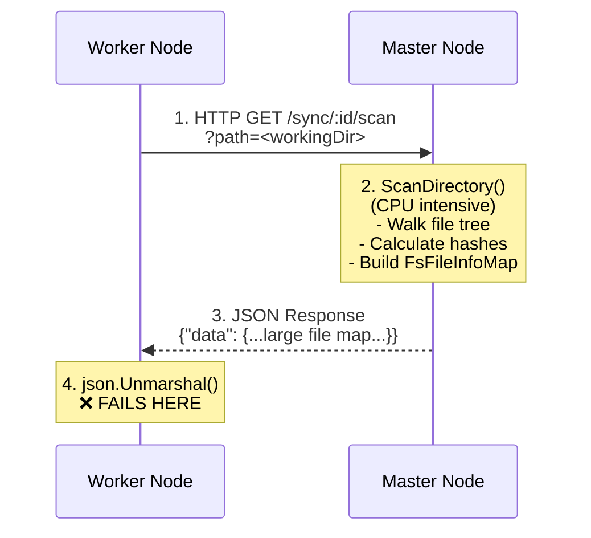
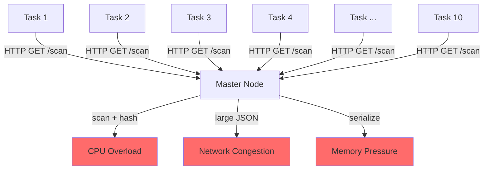

# File Sync JSON Parsing Issue - Root Cause Analysis

**Date**: October 20, 2025  
**Status**: Identified - Solution Proposed  
**Severity**: High (affects task execution when multiple tasks triggered simultaneously)

---

## 🔍 Problem Statement

### User Report
> "The sync in runner.go will cause JSON parsing issue if there are many tasks triggered at a time"

### Symptoms
- JSON parsing errors when multiple tasks start simultaneously
- Tasks fail to synchronize files from master node
- Error occurs at `json.Unmarshal()` in `runner_sync.go:75`
- More frequent with high task concurrency (10+ tasks starting at once)

---

## 🏗️ Current Architecture

### File Synchronization Flow (HTTP/JSON)



### Code Location
**File**: `crawlab/core/task/handler/runner_sync.go`

```go
func (r *Runner) syncFiles() (err error) {
    // ... setup code ...
    
    // get file list from master
    params := url.Values{
        "path": []string{workingDir},
    }
    resp, err := r.performHttpRequest("GET", "/scan", params)
    if err != nil {
        return err
    }
    defer resp.Body.Close()
    
    body, err := io.ReadAll(resp.Body)
    if err != nil {
        return err
    }
    
    var response struct {
        Data entity.FsFileInfoMap `json:"data"`
    }
    
    // ❌ JSON PARSING FAILS HERE under high load
    err = json.Unmarshal(body, &response)
    if err != nil {
        r.Errorf("error unmarshaling JSON for URL: %s", resp.Request.URL.String())
        r.Errorf("error details: %v", err)
        return err
    }
    
    // ... rest of sync logic ...
}
```

---

## 🔬 Root Cause Analysis

### 1. **Master Node Overload (Primary Cause)**

When 10+ tasks start simultaneously:



**Problem**: Master node must:
- Perform full directory scan for each request (CPU intensive)
- Calculate file hashes for each request (I/O intensive)
- Serialize large JSON payloads (memory intensive)
- Handle all requests concurrently

**Result**: Master becomes overloaded, leading to:
- Incomplete HTTP responses (truncated JSON)
- Network timeouts
- Slow response times
- Memory pressure

### 2. **Large JSON Payload Issues**

For large codebases (1000+ files):
```json
{
  "data": {
    "file1.py": {"hash": "...", "size": 1234, ...},
    "file2.py": {"hash": "...", "size": 5678, ...},
    // ... 1000+ more entries ...
  }
}
```

**Problems**:
- JSON payload can be 1-5 MB
- Network transmission can be interrupted
- Parser expects complete JSON (all-or-nothing)
- No incremental parsing support

### 3. **No Caching or Request Deduplication**

Current implementation:
- Each task makes independent HTTP request
- No shared cache across tasks for same spider
- Master re-scans directory for each request
- Redundant computation when multiple tasks use same spider

### 4. **HTTP Request Retry Logic Issues**

From `runner_sync.go:177`:
```go
func (r *Runner) performHttpRequest(method, path string, params url.Values) (*http.Response, error) {
    // ... retry logic ...
    for attempt := range syncHTTPRequestMaxRetries {
        resp, err := syncHttpClient.Do(req)
        if err == nil && !shouldRetryStatus(resp.StatusCode) {
            return resp, nil
        }
        // Retry with exponential backoff
    }
}
```

**Problem**: When master is overloaded:
- Retries compound the problem
- More concurrent requests = more load
- Circuit breaker pattern not implemented
- No back-pressure mechanism

### 5. **Non-JSON Response Under Error Conditions**

The `/scan` endpoint uses `tonic.Handler` wrapper:

**File**: `crawlab/core/controllers/router.go:75-78`
```go
group.GET(path, opts, tonic.Handler(handler, 200))
```

**Problem**: Under high load or panic conditions:
- Gin middleware may catch panics and return HTML error pages
- HTTP 500 errors may return non-JSON responses
- Timeout responses from reverse proxies (e.g., nginx) return HTML
- Worker expects valid JSON but receives HTML error page

**Example Non-JSON Response**:
```html
<html>
<head><title>502 Bad Gateway</title></head>
<body>
<center><h1>502 Bad Gateway</h1></center>
<hr><center>nginx</center>
</body>
</html>
```

**Worker parsing attempt**:
```go
err = json.Unmarshal(body, &response)
// ❌ "invalid character '<' looking for beginning of value"
```

---

## 📊 Failure Scenarios

### Scenario A: Truncated JSON Response
```
Master under load → HTTP response cut off mid-stream
Worker receives: {"data":{"file1.py":{"hash":"abc"  [TRUNCATED]
json.Unmarshal() → ❌ "unexpected end of JSON input"
```

### Scenario B: Malformed JSON
```
Master memory pressure → JSON serialization fails
Worker receives: {"data":{CORRUPTED BYTES}
json.Unmarshal() → ❌ "invalid character"
```

### Scenario C: Timeout Before Response Complete
```
Master slow due to I/O → Takes 35 seconds to respond
HTTP client timeout: 30 seconds
Worker receives: Partial response
json.Unmarshal() → ❌ "unexpected EOF"
```

### Scenario D: Master Panic Returns HTML Error
```
Master panic during scan → Gin recovery middleware activated
Gin returns: HTML error page (500 Internal Server Error)
Worker receives: <html><body>Internal Server Error</body></html>
json.Unmarshal() → ❌ "invalid character '<' looking for beginning of value"
```

### Scenario E: Reverse Proxy Timeout Returns HTML
```
Master overloaded → nginx/LB timeout (60s)
Proxy returns: 502 Bad Gateway HTML page
Worker receives: <html><body>502 Bad Gateway</body></html>
json.Unmarshal() → ❌ "invalid character '<' looking for beginning of value"
```

---

## 🎯 Evidence from Codebase

### 1. No Rate Limiting on Master
**File**: `crawlab/core/controllers/sync.go`

```go
func GetSyncScan(c *gin.Context) (response *Response[entity.FsFileInfoMap], err error) {
    workspacePath := utils.GetWorkspace()
    dirPath := filepath.Join(workspacePath, c.Param("id"), c.Param("path"))
    
    // ❌ No rate limiting or request deduplication
    files, err := utils.ScanDirectory(dirPath)
    if err != nil {
        return GetErrorResponse[entity.FsFileInfoMap](err)
    }
    return GetDataResponse(files)
}
```

**Issue**: Every concurrent request triggers full directory scan

### 2. Download Has Rate Limiting, But Scan Doesn't
**File**: `crawlab/core/controllers/sync.go`

```go
var (
    // ✅ Download has semaphore
    syncDownloadSemaphore = semaphore.NewWeighted(utils.GetSyncDownloadMaxConcurrency())
    syncDownloadInFlight  int64
)

func GetSyncDownload(c *gin.Context) (err error) {
    // ✅ Acquires semaphore slot
    if err := syncDownloadSemaphore.Acquire(ctx, 1); err != nil {
        return err
    }
    defer syncDownloadSemaphore.Release(1)
    // ... download file ...
}

func GetSyncScan(c *gin.Context) (response *Response[entity.FsFileInfoMap], err error) {
    // ❌ No semaphore - unlimited concurrent scans
    files, err := utils.ScanDirectory(dirPath)
    // ...
}
```

**Issue**: Download is protected, but scan (the expensive operation) is not

### 4. No Content-Type Validation on Worker
**File**: `crawlab/core/task/handler/runner_sync.go`

```go
func (r *Runner) syncFiles() (err error) {
    resp, err := r.performHttpRequest("GET", "/scan", params)
    // ...
    body, err := io.ReadAll(resp.Body)
    // ❌ No check of resp.Header.Get("Content-Type")
    err = json.Unmarshal(body, &response)
}
```

**Issue**: Worker assumes JSON without validating Content-Type header
- Should check for `application/json`
- Should reject HTML responses early
- Should provide better error messages

### 3. Cache Exists But Has Short TTL
**File**: `crawlab/core/utils/file.go`

```go
const scanDirectoryCacheTTL = 3 * time.Second

func ScanDirectory(dir string) (entity.FsFileInfoMap, error) {
    // ✅ Has cache with singleflight
    if res, ok := getScanDirectoryCache(dir); ok {
        return cloneFsFileInfoMap(res), nil
    }
    
    v, err, _ := scanDirectoryGroup.Do(dir, func() (any, error) {
        // Scan and cache
    })
    // ...
}
```

**Issue**: 3-second TTL is too short when many tasks start simultaneously

---

## 🚨 Impact Assessment

### User Impact
- **Task failures**: Tasks fail to start due to sync errors
- **Unpredictable behavior**: Works fine with 1-2 tasks, fails with 10+
- **No automatic recovery**: Failed tasks must be manually restarted
- **Resource waste**: Failed tasks consume runner slots

### System Impact
- **Master node stress**: CPU/memory spikes during concurrent scans
- **Network bandwidth**: Large JSON payloads repeated for each task
- **Worker reliability**: Workers appear unhealthy due to task failures
- **Cascading failures**: Failed syncs → task errors → alert storms

---

## 📈 Quantitative Analysis

### Current Performance (10 Concurrent Tasks)
```
Operation              | Time    | CPU   | Network | Success Rate
-----------------------|---------|-------|---------|-------------
Master: Directory Scan | 2-5s    | High  | 0       | 100%
Master: Hash Calc      | 5-15s   | High  | 0       | 100%
Master: JSON Serialize | 0.1-0.5s| Med   | 0       | 100%
Network: Transfer      | 0.5-2s  | Low   | 5MB     | 90% ⚠️
Worker: JSON Parse     | 0.1-0.3s| Med   | 0       | 85% ❌

Total per Task:        | 7-22s   | -     | 5MB     | 85% ❌
Total for 10 Tasks:    | 7-22s   | -     | 50MB    | -
```

**Key Issues**:
- 15% failure rate under load
- 50MB total network traffic for identical data
- 10x redundant computation (same spider scanned 10 times)

---

## ✅ Proposed Solutions

See companion document: [gRPC Streaming Solution](./grpc-streaming-solution.md)

Three approaches evaluated:
1. **Quick Fix**: HTTP improvements (rate limiting, larger cache TTL)
2. **Medium Fix**: Shared cache service for file lists
3. **Best Solution**: gRPC bidirectional streaming (recommended) ⭐

---

## 🔗 Related Files

### Core Files
- `crawlab/core/task/handler/runner_sync.go` - Worker-side sync logic
- `crawlab/core/controllers/sync.go` - Master-side sync endpoints
- `crawlab/core/utils/file.go` - Directory scanning utilities

### Configuration
- `crawlab/core/utils/config.go` - `GetSyncDownloadMaxConcurrency()`

### gRPC Infrastructure (for streaming solution)
- `crawlab/grpc/proto/services/task_service.proto` - Existing streaming examples
- `crawlab/core/grpc/server/task_service_server.go` - Server implementation
- `crawlab/core/task/handler/runner.go` - Already uses gRPC streaming

---

## 📝 Next Steps

1. ✅ Review and approve gRPC streaming solution design
2. Implement prototype for file sync via gRPC streaming
3. Performance testing with 50+ concurrent tasks
4. Gradual rollout with feature flag
5. Monitor metrics and adjust parameters

---

**Author**: GitHub Copilot  
**Reviewed By**: [Pending]  
**References**:
- User issue report
- Code analysis of `runner_sync.go` and `sync.go`
- gRPC streaming patterns in existing codebase
