# Task Assignment Issue - Visual Explanation

## 🔴 Problem Scenario: Why Scheduled Tasks Get Stuck in Pending

### Timeline Diagram

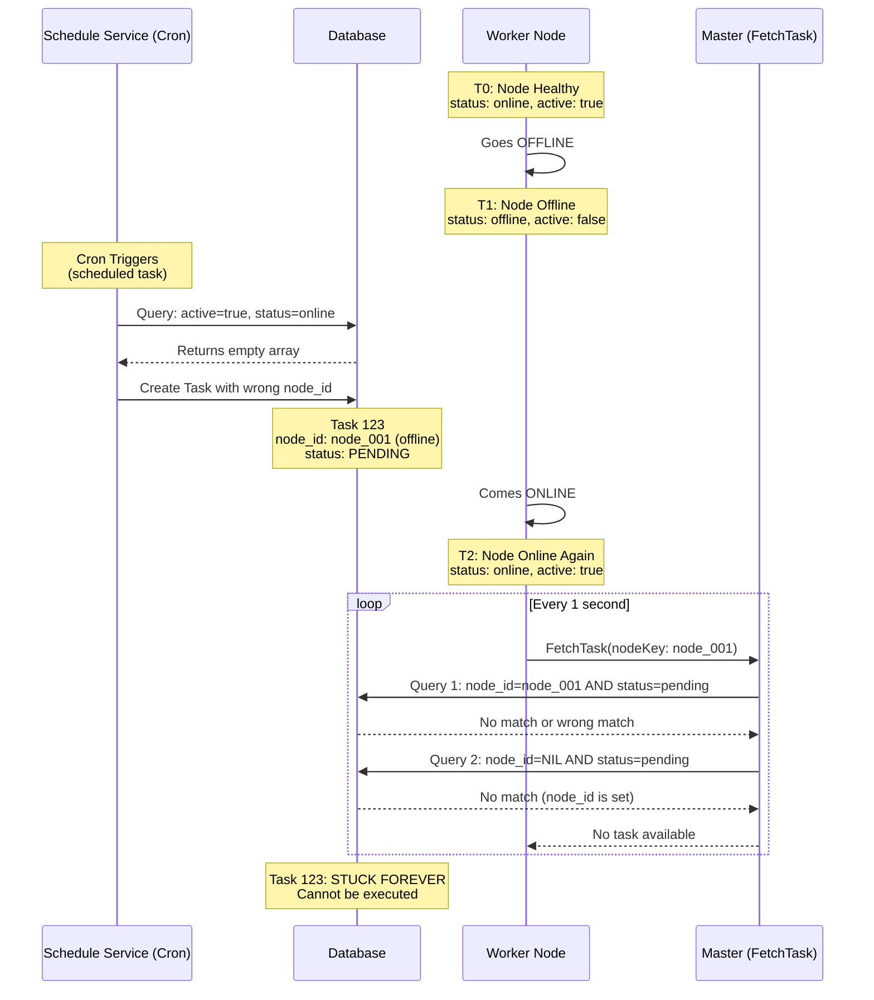

---

## 📊 System Architecture: Current Flow

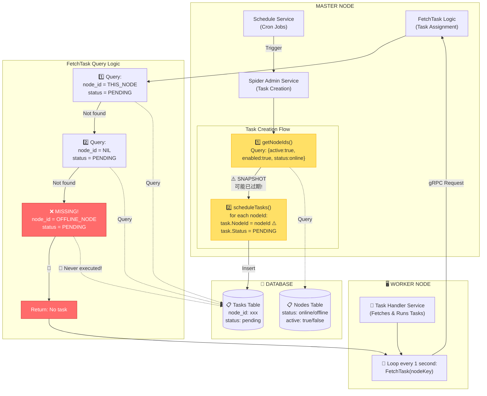

---

## 🔍 The Bug in Detail

### Scenario: Task Gets Orphaned

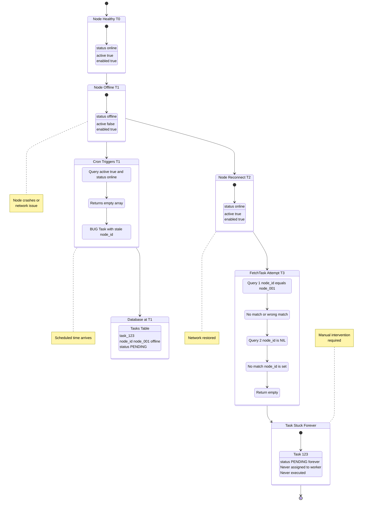

---

## 🐛 Three Critical Bugs

### Bug #1: Stale Node Snapshot

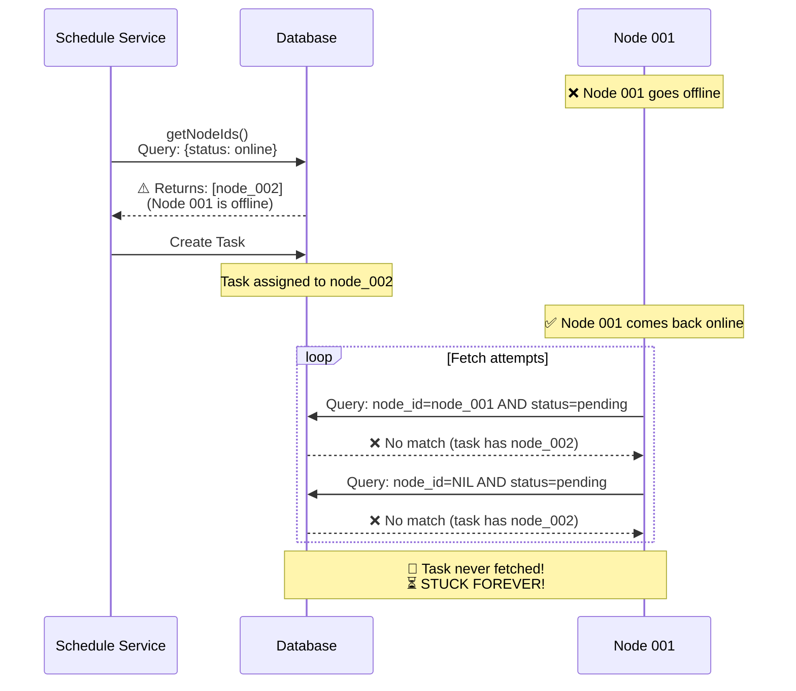

### Bug #2: Missing Orphaned Task Detection

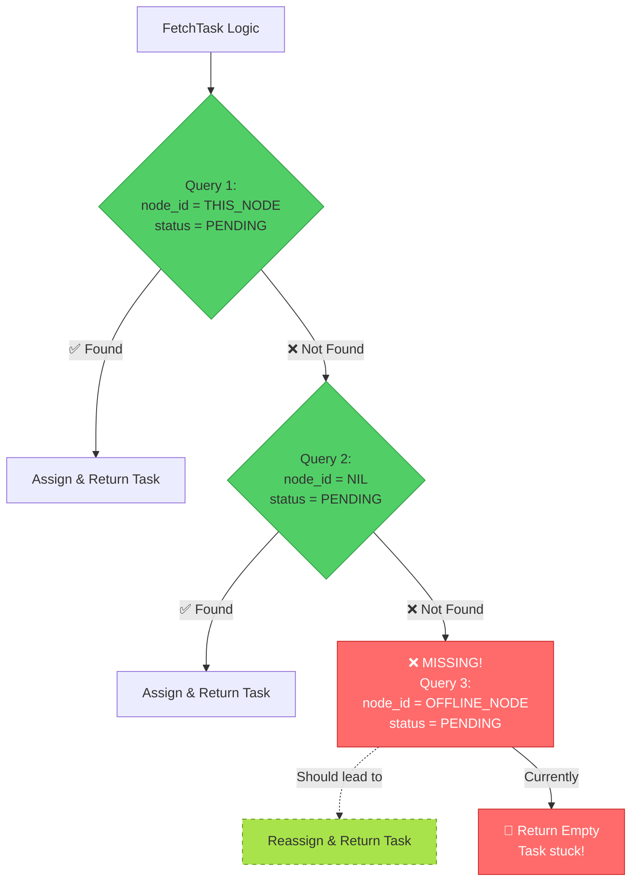

### Bug #3: No Pending Task Reassignment

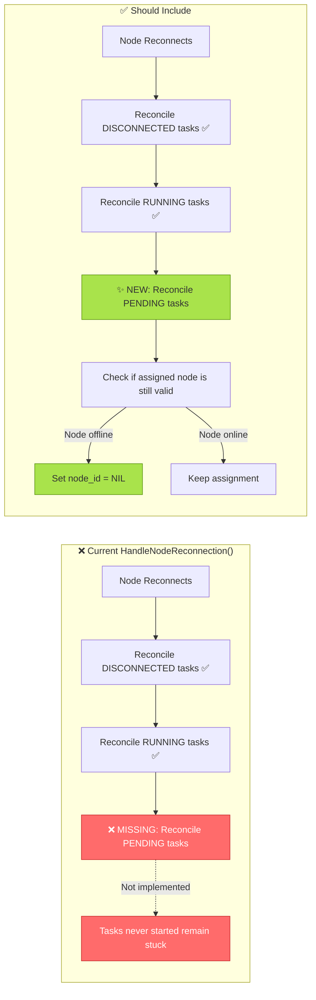

---

## ✅ Solution Visualization

### Fix #1: Enhanced FetchTask Logic

```mermaid
graph TD
    subgraph Before["❌ BEFORE - Tasks get stuck"]
        B1[FetchTask Request] --> BQ1[Query 1: my node_id]
        BQ1 -->|Not found| BQ2[Query 2: nil node_id]
        BQ2 -->|Not found| BR[🚫 Return empty<br/>Task stuck!]
    end
    
    subgraph After["✅ AFTER - Orphaned tasks recovered"]
        A1[FetchTask Request] --> AQ1[Query 1: my node_id]
        AQ1 -->|Not found| AQ2[Query 2: nil node_id]
        AQ2 -->|Not found| AQ3[✨ NEW Query 3:<br/>offline node_ids]
        AQ3 -->|Found| AR[Reassign to me<br/>& return task ✅]
    end
    
    style BR fill:#ff6b6b,stroke:#c92a2a,color:#fff
    style AQ3 fill:#a9e34b,stroke:#5c940d
    style AR fill:#51cf66,stroke:#2f9e44
```

### Fix #2: Pending Task Reassignment

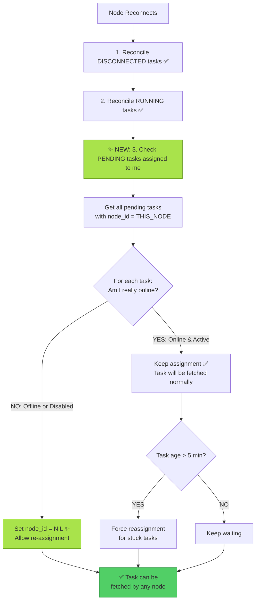

### Fix #3: Periodic Cleanup

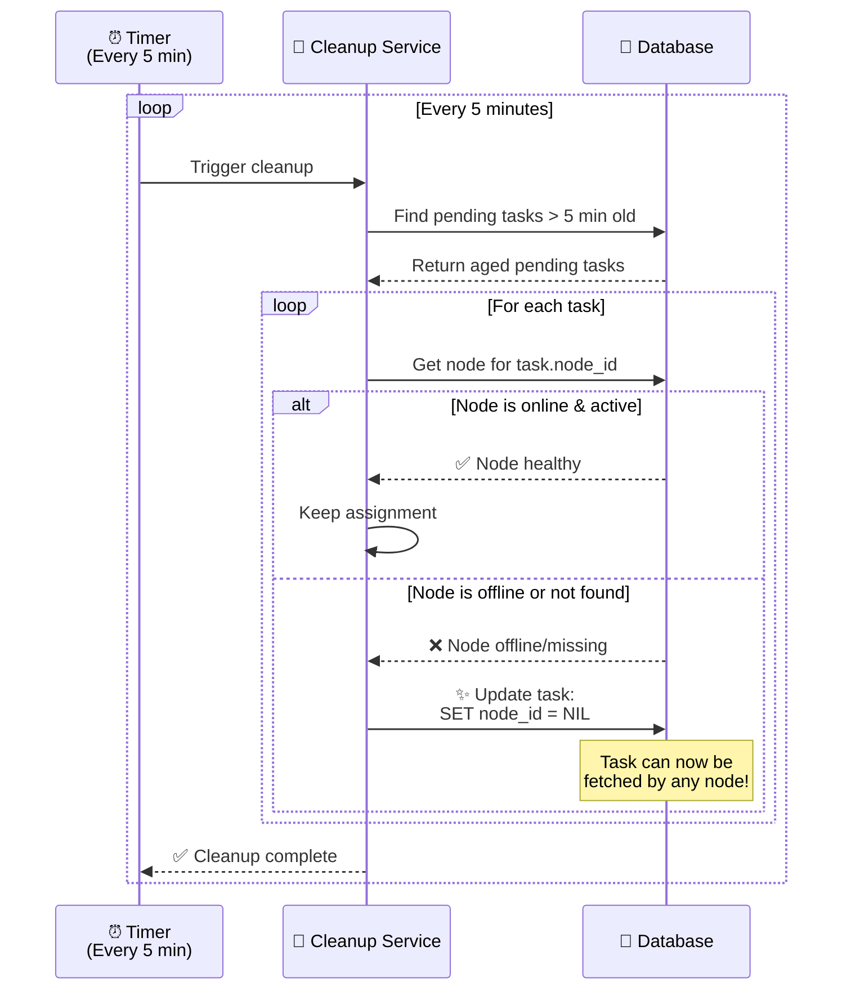

---

## 🎯 Summary

### The Core Problem

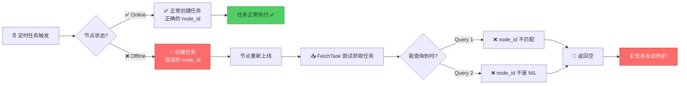

### Why It Happens

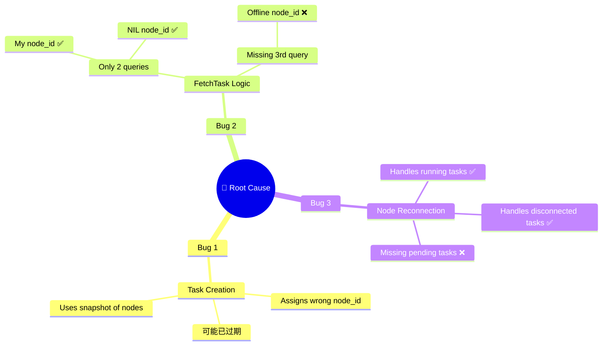

### The Fix

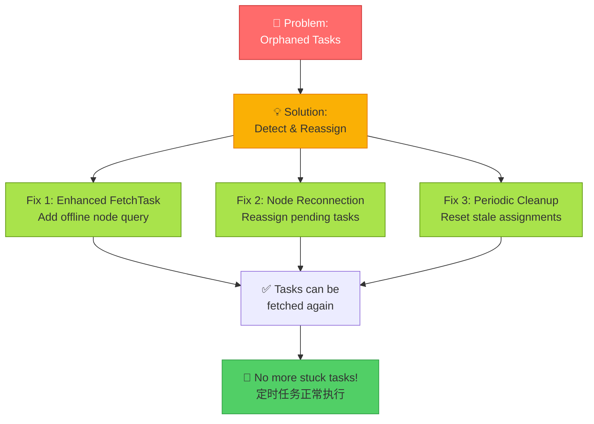

---

## 📚 Key Takeaways

| Issue | Current Behavior | Expected Behavior | Priority |
|-------|-----------------|-------------------|----------|
| **Orphaned Tasks** | Tasks assigned to offline nodes never get fetched | FetchTask should detect and reassign them | 🔴 **HIGH** |
| **Stale Assignments** | node_id set at creation time, never updated | Should be validated/updated on node status change | 🟡 **MEDIUM** |
| **No Cleanup** | Old pending tasks accumulate forever | Periodic cleanup should reset stale assignments | 🟡 **MEDIUM** |

---

**Generated**: 2025-10-19  
**File**: `/tmp/task_assignment_issue_diagram.md`  
**Status**: Ready for implementation 🚀
