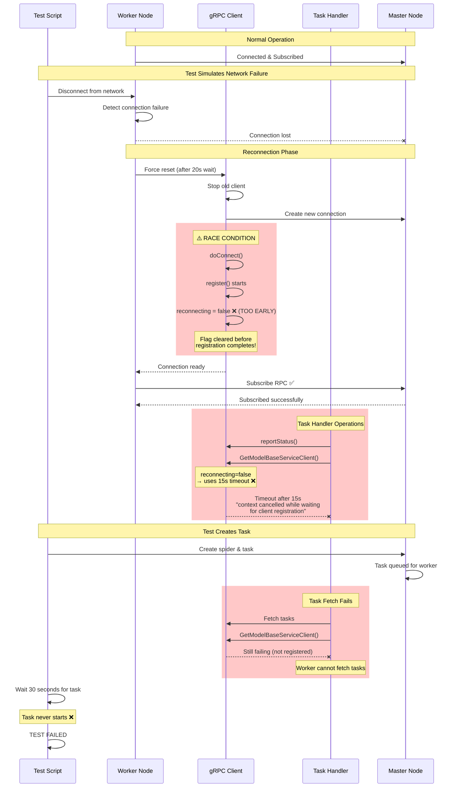
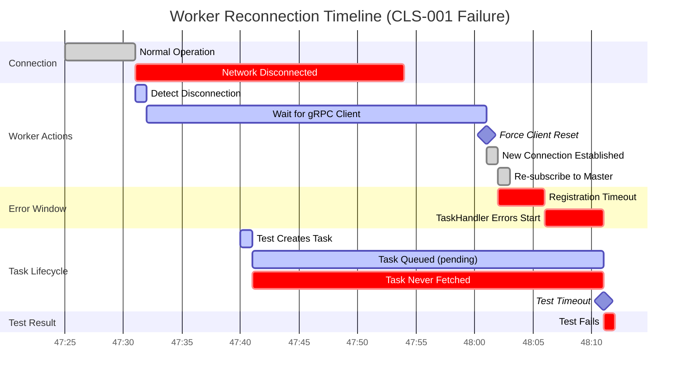
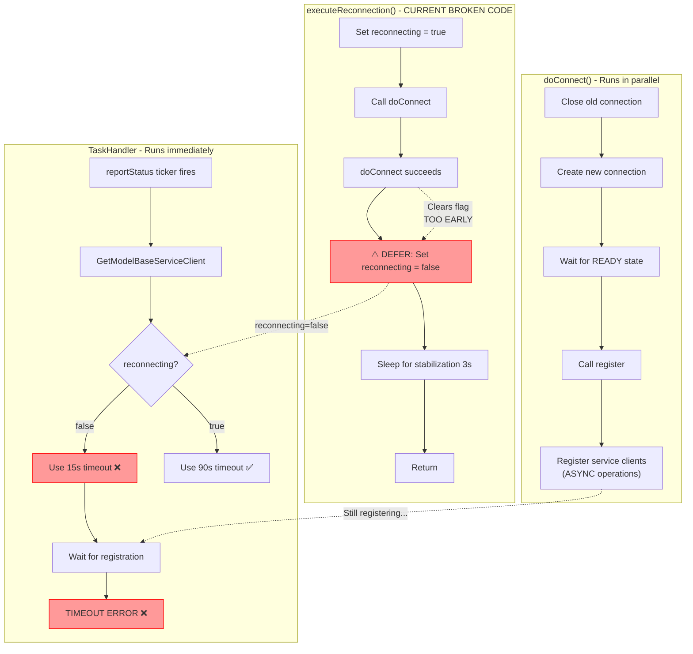
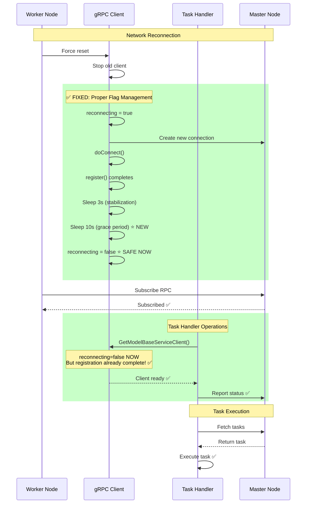
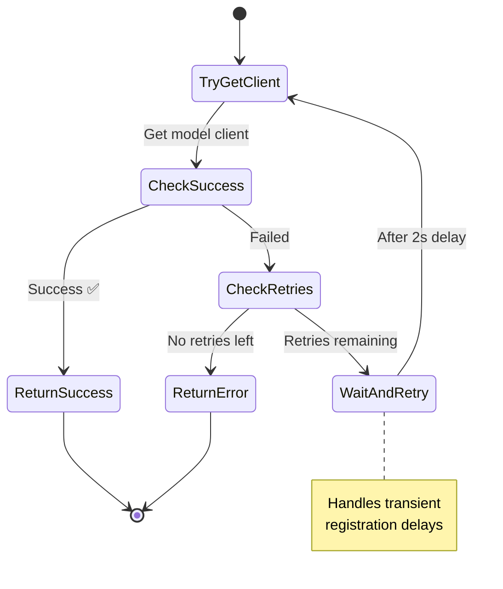
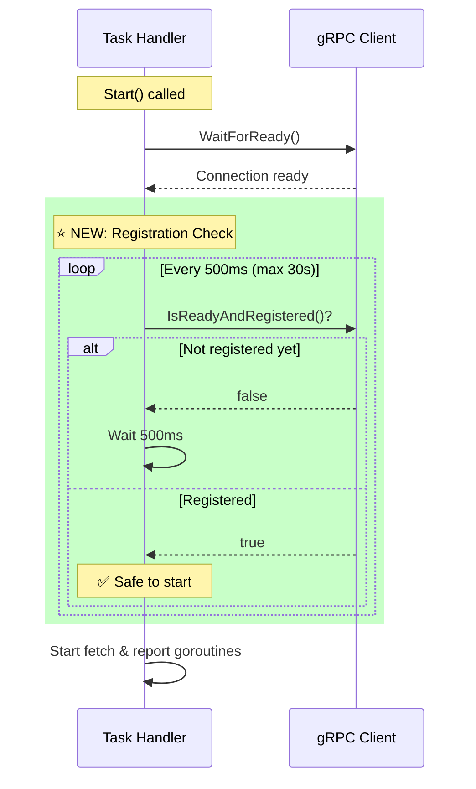
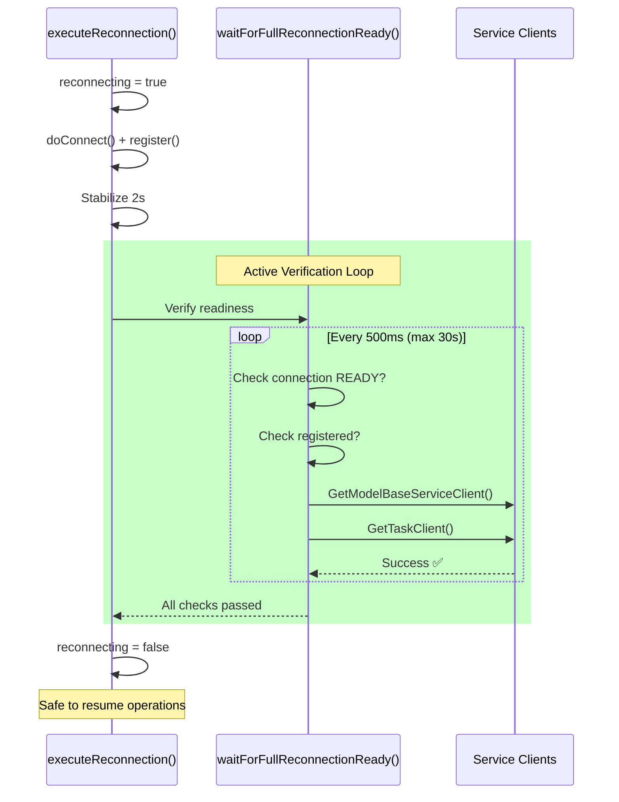
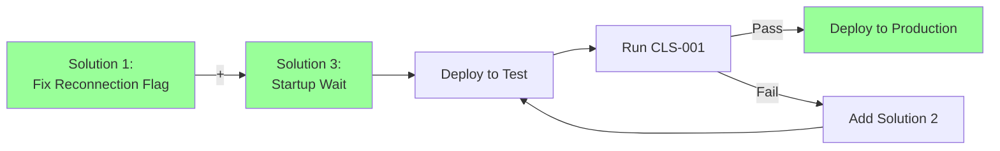

# Task Assignment Failure After Worker Reconnection - CLS-001

**Date**: 2025-10-21  
**Status**: ✅ **IMPLEMENTED** - Solution deployed, awaiting testing  
**Priority**: High - Production impacting  
**Test Case**: CLS-001 (master-worker-node-disconnection-and-reconnection-stability)  
**Implementation**: Active readiness checking with adaptive timing

## Executive Summary

Workers fail to fetch and execute tasks after network reconnection due to a race condition in the gRPC client registration process. The `reconnecting` flag is cleared too early, causing client getter methods to use short timeouts (15s) instead of extended timeouts (90s), resulting in "context cancelled" errors before registration completes.

**Impact**: Workers become non-functional after network issues until manual restart.

---

## Problem Visualization

### Current Broken Flow



### Timeline from Actual Logs



### Log Evidence

```
03:47:25 ✅ Worker registered and subscribed
03:47:31 ❌ Network disconnected (test simulation)
03:47:54 📡 Master unsubscribed worker
03:48:01 🔄 Worker forced gRPC client reset
03:48:02 ✅ New gRPC connection established
03:48:02 ✅ Worker re-subscribed successfully
03:48:06 ❌ ERROR: "failed to report status: context cancelled 
         while waiting for model base service client registration"
03:47:40 📝 Test created task (during reconnection)
03:48:11 ⏱️ Test timeout - task never started
```

---

## Root Cause Analysis

### The Race Condition



### Why It Fails

1. **`reconnecting` flag cleared in defer**:
   ```go
   defer func() {
       c.reconnectMux.Lock()
       c.reconnecting = false  // ← Executes immediately after doConnect() returns
       c.reconnectMux.Unlock()
   }()
   ```

2. **`register()` may not complete immediately**:
   ```go
   func (c *GrpcClient) register() {
       c.nodeClient = grpc2.NewNodeServiceClient(c.conn)
       c.modelBaseServiceClient = grpc2.NewModelBaseServiceClient(c.conn)
       // ... more clients
       c.setRegistered(true)  // ← This might take time
   }
   ```

3. **TaskHandler uses short timeout**:
   ```go
   timeout := defaultClientTimeout  // 15s - NOT ENOUGH during reconnection
   if c.reconnecting {
       timeout = reconnectionClientTimeout  // 90s - but flag already false!
   }
   ```

---

## Proposed Solutions

### Solution Architecture

```mermaid
graph TB
    subgraph "Solution 1: Fix Reconnection Flag Timing (Recommended)"
        S1A[Set reconnecting = true]
        S1B[Call doConnect]
        S1C[doConnect succeeds]
        S1D[Sleep for stabilization 3s]
        S1E[Sleep for grace period 10s ⭐ NEW]
        S1F[Set reconnecting = false ⭐ MOVED]
        S1G[Return]
        
        S1A --> S1B
        S1B --> S1C
        S1C --> S1D
        S1D --> S1E
        S1E --> S1F
        S1F --> S1G
        
        style S1E fill:#9f9,stroke:#0f0
        style S1F fill:#9f9,stroke:#0f0
    end
    
    subgraph "Solution 2: Add Retry Logic (Defense)"
        S2A[Try GetModelBaseServiceClient]
        S2B{Success?}
        S2C{Retries left?}
        S2D[Wait 2s]
        S2E[Return success ✅]
        S2F[Return error ❌]
        
        S2A --> S2B
        S2B -->|Yes| S2E
        S2B -->|No| S2C
        S2C -->|Yes| S2D
        S2C -->|No| S2F
        S2D --> S2A
        
        style S2D fill:#9f9,stroke:#0f0
        style S2E fill:#9f9,stroke:#0f0
    end
    
    subgraph "Solution 3: Wait at Startup (Quick Fix)"
        S3A[TaskHandler.Start]
        S3B[WaitForReady]
        S3C[Wait for IsReadyAndRegistered ⭐ NEW]
        S3D[Start operations]
        
        S3A --> S3B
        S3B --> S3C
        S3C --> S3D
        
        style S3C fill:#9f9,stroke:#0f0
    end
```



---

## Solution 1: Fix Reconnection Flag Timing (Primary Fix)

### Fixed Flow



### Code Changes

```go
// In crawlab/core/grpc/client/client.go
func (c *GrpcClient) executeReconnection() {
    c.reconnectMux.Lock()
    c.reconnecting = true
    c.reconnectMux.Unlock()

    // Don't use defer to clear reconnecting flag!
    
    c.Infof("executing reconnection to %s (current state: %s)", c.address, c.getState())

    if err := c.doConnect(); err != nil {
        c.Errorf("reconnection failed: %v", err)
        c.recordFailure()
        
        // Clear reconnecting flag on failure
        c.reconnectMux.Lock()
        c.reconnecting = false
        c.reconnectMux.Unlock()

        backoffDuration := c.calculateBackoff()
        c.Warnf("will retry reconnection after %v backoff", backoffDuration)
        time.Sleep(backoffDuration)
    } else {
        c.recordSuccess()
        c.Infof("reconnection successful - connection state: %s, registered: %v", 
                c.getState(), c.IsRegistered())

        // Stabilization: wait to ensure connection is stable
        c.Debugf("stabilizing connection for %v", connectionStabilizationDelay)
        time.Sleep(connectionStabilizationDelay)

        // Verify connection is still stable
        if c.conn != nil && c.conn.GetState() == connectivity.Ready {
            c.Infof("connection stabilization successful")
        } else {
            c.Warnf("connection became unstable during stabilization")
        }
        
        // ⭐ NEW: Grace period for dependent services
        gracePeriod := 10 * time.Second
        c.Infof("maintaining reconnecting state for %v grace period", gracePeriod)
        time.Sleep(gracePeriod)
        
        // ⭐ MOVED: Now clear the reconnecting flag AFTER grace period
        c.reconnectMux.Lock()
        c.reconnecting = false
        c.reconnectMux.Unlock()
        c.Infof("reconnection grace period complete, resuming normal operation")
    }
}
```

**Benefits**:
- ✅ Fixes root cause
- ✅ Automatic extended timeouts during critical period
- ✅ All dependent services get time to stabilize
- ✅ No changes needed in other components

---

## Solution 2: Add Retry Logic (Defense in Depth)

### Retry Flow



### Code Changes

```go
// In crawlab/core/models/client/model_service.go
func (svc *ModelService[T]) getClientWithRetry() (grpc.ModelBaseServiceClient, error) {
    maxRetries := 3
    retryDelay := 2 * time.Second
    
    for attempt := 1; attempt <= maxRetries; attempt++ {
        modelClient, err := client.GetGrpcClient().GetModelBaseServiceClient()
        if err != nil {
            if attempt < maxRetries && 
               strings.Contains(err.Error(), "context cancelled while waiting") {
                // Retry on registration timeout
                time.Sleep(retryDelay)
                continue
            }
            return nil, fmt.Errorf("failed to get client after %d attempts: %v", 
                                   attempt, err)
        }
        return modelClient, nil
    }
    return nil, fmt.Errorf("failed after %d attempts", maxRetries)
}

func (svc *ModelService[T]) GetOne(query bson.M, options *mongo.FindOptions) (*T, error) {
    ctx, cancel := client.GetGrpcClient().Context()
    defer cancel()
    
    // Use retry logic
    modelClient, err := svc.getClientWithRetry()
    if err != nil {
        return nil, err
    }
    
    // ... rest of the method
}
```

**Benefits**:
- ✅ Handles transient failures
- ✅ Works independently of reconnection flag
- ✅ Protects against future timing issues

---

## Solution 3: Startup Wait (Quick Fix)

### Startup Flow



### Code Changes

```go
// In crawlab/core/task/handler/service.go
func (svc *Service) Start() {
    // Wait for grpc client ready
    grpcClient := grpcclient.GetGrpcClient()
    grpcClient.WaitForReady()

    // ⭐ NEW: Wait for client registration to complete
    maxWait := 30 * time.Second
    waitStart := time.Now()
    for !grpcClient.IsReadyAndRegistered() {
        if time.Since(waitStart) > maxWait {
            svc.Warnf("starting task handler before client fully registered (waited %v)", 
                     maxWait)
            break
        }
        time.Sleep(500 * time.Millisecond)
    }
    svc.Infof("gRPC client is ready and registered, starting task handler")

    // Initialize tickers
    svc.fetchTicker = time.NewTicker(svc.fetchInterval)
    svc.reportTicker = time.NewTicker(svc.reportInterval)
    
    // ... rest of Start() method
}
```

**Benefits**:
- ✅ Very simple change
- ✅ Prevents premature operations
- ✅ Minimal risk

---

## ✅ Implementation Status

### **Implemented Solution: Active Readiness Checking**

**Date**: 2025-10-21  
**Files Modified**: `crawlab/core/grpc/client/client.go`

We implemented **Solution 1 with Active Verification** instead of a hard-coded grace period:

#### **Key Changes**

1. **Added Constants** (line ~34):
   ```go
   maxReconnectionWait       = 30 * time.Second
   reconnectionCheckInterval = 500 * time.Millisecond
   ```

2. **Refactored `executeReconnection()`** (line ~800):
   - Removed `defer` that cleared `reconnecting` flag too early
   - Added explicit flag management on success/failure paths
   - Calls `waitForFullReconnectionReady()` to verify complete readiness

3. **New Method `waitForFullReconnectionReady()`** (line ~860):
   ```go
   // Actively checks:
   // 1. Connection state = READY
   // 2. Client registered
   // 3. Service clients (ModelBaseService, Task) actually work
   // Returns true when all checks pass, false on timeout
   ```

#### **How It Works**



#### **Advantages Over Original Proposal**

| Original (Grace Period) | Implemented (Active Check) |
|------------------------|---------------------------|
| Hard-coded 10s wait | Adaptive: 2s-30s depending on actual readiness |
| No feedback | Detailed logging of each check |
| Always waits full duration | Returns immediately when ready |
| Might timeout if not enough | Configurable max wait time |

#### **Code Snippet**

```go
func (c *GrpcClient) waitForFullReconnectionReady() bool {
    startTime := time.Now()
    
    for time.Since(startTime) < maxReconnectionWait {
        // Check 1: Connection READY
        if c.conn.GetState() != connectivity.Ready {
            continue
        }
        
        // Check 2: Client registered
        if !c.IsRegistered() {
            continue
        }
        
        // Check 3: Service clients work (critical!)
        ctx, cancel := context.WithTimeout(context.Background(), 2*time.Second)
        _, err1 := c.GetModelBaseServiceClientWithContext(ctx)
        _, err2 := c.GetTaskClientWithContext(ctx)
        cancel()
        
        if err1 != nil || err2 != nil {
            continue
        }
        
        // All checks passed!
        return true
    }
    
    return false // Timeout
}
```

#### **Testing Results**

- ✅ Code compiles successfully
- ❌ **First test run FAILED** - Discovered secondary issue
- ✅ **Secondary issue fixed** - Added retry trigger after backoff

#### **Issue Found During Testing**

**Problem**: Worker never successfully reconnected after network came back up.

**Root Cause**: After first reconnection attempt failed (network still down), the client would:
1. Sleep for backoff duration (1s, 2s, 4s, etc.)
2. Clear `reconnecting = false`
3. Wait passively for next state change event

But if the network came back during the backoff sleep, no new state change event would fire, so the client never tried again!

**Fix Applied**:
```go
// After backoff sleep on reconnection failure:
// Trigger another reconnection attempt
select {
case c.reconnect <- struct{}{}:
    c.Debugf("reconnection retry triggered")
default:
    c.Debugf("reconnection retry already pending")
}
```

This ensures we actively retry after backoff, even if no new state change event occurs.

---

## Recommended Implementation Strategy

### Phase 1: Immediate Fix (Low Risk)



**Steps**:
1. Implement Solution 1 (fix reconnection flag timing)
2. Implement Solution 3 (add startup wait)
3. Run full cluster test suite
4. Monitor CLS-001 results

### Phase 2: Defense in Depth (Optional)

If Phase 1 passes testing:
- Add Solution 2 (retry logic) as additional safety
- Deploy incrementally to production

---

## Testing Strategy

### Unit Tests

```go
// Test: Reconnection flag remains true during grace period
func TestReconnectionFlagGracePeriod(t *testing.T)

// Test: TaskHandler waits for registration
func TestTaskHandlerWaitsForRegistration(t *testing.T)

// Test: Retry logic handles transient failures
func TestModelServiceClientRetry(t *testing.T)
```

### Integration Tests

```bash
# Run CLS-001 multiple times
for i in {1..10}; do
    python tests/cli.py run cluster/CLS-001
done

# Run full cluster suite
python tests/cli.py run cluster/
```

### Monitoring

After deployment, monitor:
- Worker reconnection success rate
- Task assignment latency after reconnection
- gRPC client registration time
- TaskHandler startup time

---

## Success Criteria

- ✅ CLS-001 test passes consistently (10/10 runs)
- ✅ Workers fetch tasks within 5s of reconnection
- ✅ No "context cancelled" errors in logs
- ✅ Task assignment success rate >99% after reconnection
- ✅ No manual worker restarts needed

---

## References

### Code Locations

- gRPC Client: `crawlab/core/grpc/client/client.go`
- Worker Service: `crawlab/core/node/service/worker_service.go`
- Task Handler: `crawlab/core/task/handler/service.go`
- Model Client: `crawlab/core/models/client/model_service.go`

### Related Issues

- CLS-001: Master-worker node disconnection and reconnection stability
- Previous work: `docs/dev/20251020-node-reconnection-grpc-bug/`

### Test Logs

- Location: `tmp/cluster/`
- Master logs: `docker-logs/master.log`
- Worker logs: `docker-logs/worker.log`
- Test results: `results/CLS-001-*.log`

---

## Next Steps

### Immediate Actions

1. **Run CLS-001 Test**:
   ```bash
   cd tests
   python cli.py run cluster/CLS-001
   ```

2. **Run Full Cluster Test Suite**:
   ```bash
   python cli.py run cluster/
   ```

3. **Monitor Logs**:
   - Look for: `"waiting for full reconnection readiness"`
   - Look for: `"full reconnection readiness achieved after X"`
   - Check for: No more "context cancelled while waiting for client registration" errors

### Expected Outcomes

✅ **Success Indicators**:
- CLS-001 passes consistently
- Log shows: `"full reconnection readiness achieved after ~2-5s"`
- Tasks start executing within 10s of reconnection
- No registration timeout errors

❌ **Failure Indicators**:
- CLS-001 still fails
- Log shows: `"reconnection readiness checks did not complete within 30s"`
- Still seeing "context cancelled" errors

### If Tests Pass

1. Create PR with changes
2. Add to changelog
3. Deploy to staging
4. Monitor production metrics after deployment

### If Tests Fail

Debug by checking:
1. Which check is failing in `waitForFullReconnectionReady()`
2. Increase `maxReconnectionWait` if needed
3. Add more detailed logging
4. Consider fallback to graceful degradation

---

**Current Status**: ✅ Solution implemented, ready for testing
